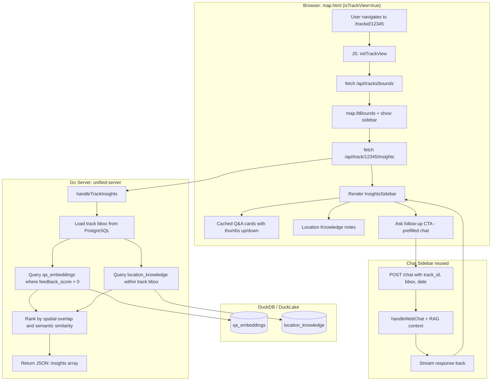
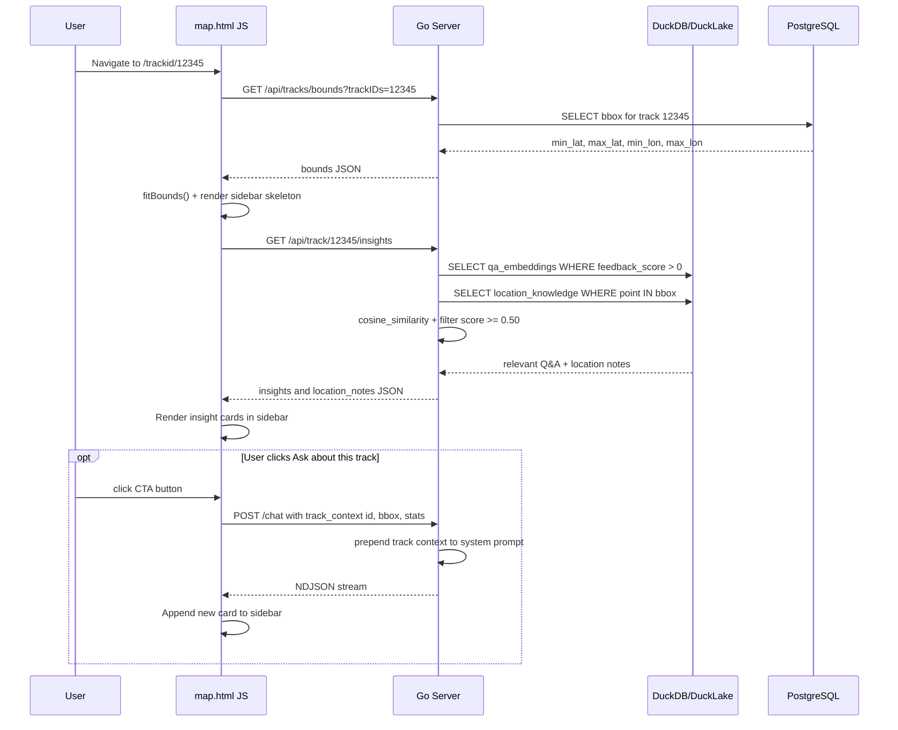

# Track-Detail RAG Insights Sidebar

**Status:** Proposed  
**Date:** 2026-04-02

## Overview

When a user enters "single track mode" (`/trackid/{id}`), a sidebar panel appears alongside the map showing cached RAG/MCP responses that are spatially and contextually relevant to the current track. The goal is to surface "what we already know" about the measurement area and session without requiring the user to ask a question manually.

---

## Architecture Diagram



---

## Sequence Diagram



---

## Relevance Ranking

Insights are ranked by a combination of three signals:

| Signal | Weight | Method |
|---|---|---|
| **Positive feedback gate** | Hard filter | Only surface `qa_embeddings` with `feedback_score > 0` |
| **Spatial overlap** | High | `location_knowledge` rows whose `(lat, lon, radius_m)` intersects the track bounding box |
| **Semantic similarity** | Medium | Auto-generate a query like `"radiation levels near [bbox centroid] on [track date]"`, embed it, cosine-compare against `qa_embeddings` (threshold ≥ 0.50) |
| **Recency** | Tiebreak | Newer entries ranked higher when similarity scores are equal |

---

## New Backend Components

### `GET /api/track/{id}/insights`

New endpoint in [rest_tracks.go](../cmd/unified-server/rest_tracks.go).

**Request:** `GET /api/track/12345/insights`

**Response:**
```json
{
  "track_id": 12345,
  "insights": [
    {
      "chat_id": 789,
      "question": "What radiation levels were measured near Fukushima in 2014?",
      "answer": "Measurements in this area showed...",
      "similarity_score": 0.82,
      "feedback_score": 1
    }
  ],
  "location_notes": [
    {
      "lat": 37.42,
      "lon": 141.03,
      "note": "Near Fukushima exclusion zone boundary. Elevated background expected.",
      "source_chat_id": 456
    }
  ]
}
```

### `handleTrackInsights()`

New function in [semantic_cache.go](../cmd/unified-server/semantic_cache.go) (or a new `track_insights.go`).

Logic:
1. Load track bounding box from PostgreSQL
2. Auto-generate a representative query string from track metadata (bbox centroid, date, detector type)
3. Embed the query string using existing `getEmbedding()`
4. Load all `qa_embeddings` where `feedback_score > 0` from DuckLake
5. Compute cosine similarity; keep results ≥ 0.50, return top 5
6. Load all `location_knowledge` rows whose point falls within the track bbox
7. Return merged, ranked result

### Track Context Injection

When the user clicks "Ask about this track", the `POST /chat` body includes a `track_context` field:

```json
{
  "message": "Tell me about the radiation levels on this track",
  "track_context": {
    "id": 12345,
    "bbox": { "min_lat": 37.1, "max_lat": 37.5, "min_lon": 140.8, "max_lon": 141.2 },
    "date": "2014-08-15",
    "detector": "bGeigie Nano",
    "measurement_count": 842
  }
}
```

`handleWebChat()` in [mcp_register.go](../cmd/unified-server/mcp_register.go) prepends this as structured context in the system prompt, grounding the LLM response in the specific track.

---

## New Frontend Components

All changes go in [map.html](../cmd/unified-server/public_html/map.html).

### Sidebar Panel

- Mirrors the existing chat sidebar layout
- Shown only when `isTrackView=true`
- Positioned on the right side of the map, collapsible

### Insight Card

- Displays: question, answer (truncated with expand), similarity score badge, thumbs up/down
- Reuses the existing `/api/feedback` endpoint for user scoring

### Auto-load Trigger

- `fetchTrackInsights(currentTrackID)` fires after `fitBounds()` completes
- Shows a loading skeleton while fetching
- Falls back gracefully if no cached insights exist ("No cached insights yet for this area")

### "Ask about this track" Button

- Pre-populates the chat with a context-aware prompt
- Opens or expands the chat/sidebar panel
- Passes `track_context` in the request body

---

## Existing Infrastructure Reused

| Component | File | Reuse |
|---|---|---|
| Semantic cache lookup | `semantic_cache.go` | `getEmbedding()`, cosine similarity logic |
| Feedback recording | `mcp_register.go:handleFeedback()` | Unchanged — insight cards use same endpoint |
| Chat streaming | `mcp_register.go:handleWebChat()` | Extended to accept `track_context` |
| Track bounds | `rest_tracks.go:handleTrackBounds()` | Called internally by insights handler |
| DuckLake tables | `duckdb_analytics.go` | `qa_embeddings`, `location_knowledge` — no schema changes needed |

---

## Phased Implementation

### Phase 1 — Read-only sidebar

- New `GET /api/track/{id}/insights` endpoint
- `handleTrackInsights()` with spatial + semantic ranking
- Sidebar HTML/CSS in map.html (visible when `isTrackView=true`)
- Auto-fetch and render cached Q&A cards on track load

### Phase 2 — Interactive follow-up

- "Ask about this track" CTA that pre-fills `/chat` with track context
- `handleWebChat()` extended to accept and inject `track_context`
- New chat responses on a track view are tagged with `track_id` in `chat_questions` table

### Phase 3 — Richer signals

- Display `location_knowledge` notes as map pins overlaid on the track view
- "Why relevant" tooltip showing the similarity score
- Positive feedback on a track insight auto-tags `location_knowledge` with the track's bbox centroid, creating a compounding knowledge loop

---

## Key File Locations

| File | Role |
|---|---|
| [cmd/unified-server/rest_tracks.go](../cmd/unified-server/rest_tracks.go) | New `/api/track/{id}/insights` endpoint |
| [cmd/unified-server/semantic_cache.go](../cmd/unified-server/semantic_cache.go) | `handleTrackInsights()` ranking logic |
| [cmd/unified-server/mcp_register.go](../cmd/unified-server/mcp_register.go) | `handleWebChat()` track context injection |
| [cmd/unified-server/duckdb_analytics.go](../cmd/unified-server/duckdb_analytics.go) | DuckLake table schema (no changes needed) |
| [cmd/unified-server/public_html/map.html](../cmd/unified-server/public_html/map.html) | Sidebar UI + JS |
